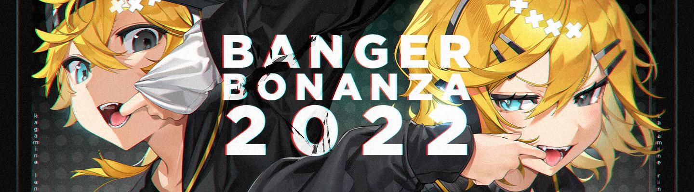

---
tags:
  - badge
  - badges
  - badged
---

# Official tournament support

*For beatmapping contest support, see: [Official beatmapping contest support](/wiki/Contests/Official_support).*

The [Tournament Committee](/wiki/People/Tournament_Committee) ("committee") runs a program where they provide community-run tournaments that abide by certain criteria and expectations with extra support, at their discretion. This program is overseen by the [osu! team](/wiki/People/osu!_team). This article details all procedures and regulations pertaining to this program.

As the tournament landscape continues to evolve, the committee routinely updates this article as needed. The committee works with the [account support team](/wiki/People/Account_support_team) to execute the rules and procedures defined here.

This article was last updated on TODO: DATE. A complete changelog is maintained in the [tournament support updates thread](https://osu.ppy.sh/community/forums/topics/1715676). For any queries or clarifications, please [contact the committee](#contact).

## Conventions

To reduce ambiguity, the words and phrases defined in [RFC-2119](https://www.ietf.org/rfc/rfc2119.txt) are adopted. These terms are used in **bold** to differentiate between what is strictly required, what is suggested, and what is optional.

- **Must** - This word—or the terms **required** or **shall**—represent an absolute requirement.
- **Must not** - This phrase—or the phrase **shall not**—represents an absolute prohibition.
- **Should** - This word—or the adjective **recommended**—means that there may exist valid reasons to ignore a particular item, but the full implications must be understood before deviating from the recommended course of action.
- **May** - This word—or the adjective **optional**—means that an item is truly optional. These terms are often followed by specific conditions which must be met before the optional component is realised. In these cases, the words **if** or **unless** are used to define the conditions.

## Foreword

It is incredibly important that tournament hosts and co-hosts understand the weight of choosing to request official support. While there are many benefits, there are also many potential downsides should the tournament fail to adhere to the criteria, including account action and reputational damage. Tournament hosts **must** be prepared to adhere to all [eligibility criteria](#eligibility-criteria) prior to submitting the support request.

Thus, the committee **strongly recommends** that prospective hosts first staff in several tournaments in a variety of roles—at least as a referee—before hosting **any** tournament. It is then **recommended** to request official support after hosting at least one tournament without requesting support.

The committee expects tournament hosts requesting this support to follow all criteria exactly as written. Hosts and co-hosts are all equally, chiefly responsible for the success of their tournaments and will generally be actioned equally should it be warranted. So long as an avenue exists such that host action could have prevented the denial of support, they will be held responsible.

For example, if a non-compliant beatmap makes its way into a mappool, the hosts are the ones held responsible, not the staff who selected the beatmap. This is because it is the responsibility of the hosts to check for beatmap compliance, per the eligibility criteria.

## Benefits

Tournaments which are granted official support receive the following:

- [Profile badge prizes](#profile-badges) for first-place winners.
- Potential consideration for a [main-menu banner advertisement](#requesting-in-game-banner-and-news-post-support) during major matches.
- Potential consideration for [news coverage](#requesting-in-game-banner-and-news-post-support), one post advertising registrations and one summarising final results.

## Eligibility criteria

Tournaments requesting official support (and any associated preliminary events[^preliminary-event]) **must** adhere to the eligibility criteria.

### Core ideals

Community-run tournaments receiving this support **must** abide by the following core ideals:

- Remain free and fair.
- Be as transparent as possible.
- Preserve competitive integrity.
- Encourage good sportsmanship.

### Format

Format criteria are **inflexible, absolute fundamentals** that all officially-supported tournaments **must** abide by. Any violation of the below points will immediately result in a [revocation of support](#revocation-of-support):

- The tournament series **must not** run more than two times per year.
- The tournament format **must** be at least Round of 16 double-elimination or Round of 32 single-elimination.
  - For LAN tournaments, the format **must** be at least Round of 8 double-elimination or Round of 16 single-elimination.
  - Larger formats, such as group stages and Swiss brackets, **may** also be used **if** they start with at least 16 teams and, if applicable and if starting with only 16 teams, break to a double-elimination bracket afterwards.
  - Draft or auction style tournaments **may** follow the same reduced bracket size as LAN events **if** they are open rank and have a minimum team size of 8.
    - Note: This applies to a maximum of 2 divisions for global or continental tournaments and 1 division for smaller-scale tournaments.
  - To request official support for an alternate format, hosts **must** [contact the committee](#contact) and receive written approval **before** accepting registrations for the event.
- Tournaments that are not open rank **must not** allow participants whose numeric global rank value is larger than:
  - osu!: 100,000
  - osu!taiko: 10,000
  - osu!catch: 5,000
  - osu!mania 4K: 40,000
  - osu!mania 7K: 5,000
- Tournament organisers **shall not** collect, allow the submission of, or utilise any personal information[^personal-information] from any registrants for any reason outside of these defined exceptions:
  - Email addresses **may** be collected and used by tournament organisers for any reason **if** it is absolutely necessary for the tournament to function.
  - Personal information **may** be collected as needed to fulfill legal, financial, or tax obligations and to fulfill the distribution of monetary or physical prizes.
  - Other exceptions to this rule **may** be granted by the committee, provided the tournament organiser provides a thorough justification to them via [tournaments@ppy.sh](mailto:tournaments@ppy.sh) well before any such information is collected.
  - For tournaments restricting registrations by country, profile flags **should** be used as the basis for entry.
- In cases where **any** personal information is collected from registrants for any reason **other than** distribution of prizes:
  - Tournament organisers **must** include a privacy policy on the tournament's forum post and/or wiki page **immediately upon forum post publication** detailing the following:
    - Any users, organisations, or other entities who can view this information.
    - How the information will be stored and processed.
    - What the information will be used for.
  - Modifications to the privacy policy **must** be announced publicly.

### Quality

Officially-supported tournaments **must** meet certain quality standards and maintain them throughout the tournament. Low-quality events are subject to [revocation of support](#revocation-of-support).

- Forum post graphics, profile badges, stream overlays, and other graphics **must** have a reasonable amount of effort put into them. A consistent theme following standard design principles is **required**.
  - Graphic designers are frequently commissioned to handle this aspect of the tournament.
- The tournament **should** feature visually appealing, clearly readable spreadsheets which contain all of the information required by the committee to conduct the tournament review process:
  - Registrants
  - Mappools
  - Schedule (qualifier, bracket, group stage, etc.) with match links
  - Qualifier results with match links
- If not using spreadsheets, all of the above information **must** be made publicly available via a website or other means. Whatever the method, it **must** be at least as accessible as a public spreadsheet, contain all of the necessary information, and **should** be more convenient to use than a spreadsheet.
- There **should not** be many organisational problems, such as issues with holding matches on time.
- Rules **must** be enforced consistently. Rules **must** be written in a way that proactively removes ambiguity.

#### Tri-badge {id=tri-badge-quality}

The tri-badge distinction is reserved for tournaments achieving the highest level of production quality possible in osu! tournaments. In general, it should be **obvious** the tournament is worthy of receiving the distinction due to its outstanding quality, competition, and community impact.

Hosts aiming to achieve this support (see [tri-badge support](#tri-badge-support)) are expected to achieve as many of the below criteria as possible. Items with "**must**" are not optional criteria for those seeking this support.

- The tournament **must not** violate **any** other criteria listed in this article.
- The tournament **must** be open rank and **must not** be restricted to any specific geographic region.
  - Drafts, suiji, and other formats that modify the team creation process are permitted.
- Rules and regulations **must** be thoroughly thought through and documented **exceptionally well**.
  - Rules **should not** need to be changed during the course of the event.
- Rules and regulations **must** be enforced with **extremely high** accuracy. Issues with normal tournament operations are expected to be handled **exceptionally** well.
- Stream overlays and other graphics **must** be of **extremely high** quality.
  - Stream overlays **must** provide an excellent viewing experience, and **must not** have unnecessary clutter, unpolished elements, misaligned text, or text that unpleasantly clashes with background imagery.
  - Stream overlays **should** be fully animated.
  - Animated stinger transitions **should** be used between screens.
- Stream overlays **must** function **flawlessly** by the time the finals round is reached. While it is understood that bugs and issues occur in early rounds, these **must** be resolved as early as possible.
- Player and community interest in the tournament **should** be **exceptionally high**.
- Viewership of late-stage livestreams **should** be among the highest for tournaments of the same mode.
- The tournament **should** be widely respected and highly anticipated by the community.
- The level of competition **must** be **extremely high**.
- A tournament website **may** be used. **If** so, it **must** function **exceptionally** well. A website that does not match the rest of the tournament's quality is worse than no website at all.
- A vast majority of matches **must** be livestreamed with **high-quality** commentary. The **recommended** broadcast resolution is 1920x1080 at 60FPS. The goal **should** be to stream and commentate as many matches as possible.
- Barring exceptional circumstances, livestreams **must** be recorded. Recordings **must** be preserved and **should** be elegantly curated.
  - Saving livestream recordings and re-publishing to a video hosting platform, such as YouTube, is **recommended**.
  - Uploads **should** have thumbnails.

In exceptionally rare cases, tournaments that meet or exceed these expectations **may** be granted the privilege of awarding badges to their top three finalists. This is given exclusively at the discretion of the osu! team.

#### Forum graphics

Below are header images used in various community tournaments which did not receive any [additional support](#additional-support). These headers should be used as a reference for **above average** graphics quality. This level of quality should be aimed for by tournaments seeking official support.

For each of these tournaments, take note of the design of the forum post and other imagery used across the forum post and tournament spreadsheets.

##### Banger Bonanza 2022

[](https://osu.ppy.sh/community/forums/topics/1541618?n=1)

##### Stage's Tranquility Tournament 4

[](https://osu.ppy.sh/community/forums/topics/1948257?n=1)

### Regulatory

Tournaments requesting official support **must** adhere to the following:

- The tournament **must** abide by the following content usage rules:
  - Any beatmaps used in the tournament **must not** have a DMCA takedown notice.
  - Using any beatmaps that violate [content usage permission rules](/wiki/Rules/Content_usage_permissions#artist-permissions) **shall not** be used, **unless** they are Ranked, Approved, or Loved.
    - If permission to use disallowed songs is granted by the artist, the host **must** include proof of permission in their email to [tournaments@ppy.sh](mailto:tournaments@ppy.sh) upon tournament conclusion. Hosts **must** receive permission from the artist prior to its use in the tournament.
  - The [mappool compliance](https://tcomm.hivie.tn/mappool-compliance) tool **should** be used to ensure tournament mappools are compliant.
- All registrants **must** be screened by the [account support team](/wiki/People/Account_support_team) before play commences.[^play-commence] See [screening](#screening) for more details.
- If a user satisfies the sign-up criteria (if any) and is not [filtered](#registrant-filtering-and-seeding) out through other means, the tournament **must not** prevent those who pass the screening from participating without both ample evidence presented publicly against them and the approval of the account support team.
  - This includes preventing users who are perceived to be "sandbagging" from play. Should an organiser have valid concerns about the presence of such players affecting the competitive integrity of their tournament, they may raise the issue to the [Tournament Committee](/wiki/People/Tournament_Committee) for a case-by-case review using the [tournament reports form](https://tcomm.hivie.tn/reports/create).
  - Disqualifying a user due to breach of tournament rules is allowed without prior approval. However, hosts **must** document such cases and retain evidence in the event the legitimacy of the disqualification is challenged.
- A dedicated referee **must** be present during every match, or be available to be summoned with minimal delay (less than five minutes) **if** permission for [automated software](#automated-refereeing) has been granted and is being used for assistance. Players **must not** "self-ref".
- Every match within the same bracket or Qualifier stage **must** be held in a consistent format. For example, in a tournament which uses a Qualifier stage and a double-elimination bracket stage, bracket matches should all be played either synchronously or asynchronously, but not both.
- All multiplayer matches relevant to the tournament **must** be created with the `!mp make` command, so that they do not expire. The results **must** be recorded and made publicly available on the original tournament forum post or an outside source linked on the forum post in a clear and accessible format.
- All relevant rule changes **must** be communicated clearly to all participants.
- All relevant links **must** be present and maintained on the tournament's forum post.
  - The main spreadsheet, online bracket, event website, twitch streams, Discord, and other core links are expected to be on the forum post. Other links, such as statistics, **may** be included on the tournament's main spreadsheet instead.
- All promotional material or services associated with a tournament receiving official support **must** adhere to the [osu! community rules](/wiki/Rules). This includes things like Twitter accounts, Discord servers, and so on.
- All forum threads associated with the tournament **must** contain this snippit at the very end of the forum post:

```
[centre]
[url=https://tcomm.hivie.tn/reports/create]Tournament reports form[/url]
[/centre]
```

#### Organisers

Tournament organisers...

- **Must** report instances of foul play, misconduct, and violations of the staff & player expectations outlined below to the committee (see [contact](#contact)). Similarly, players and staff share a responsibility to inform the committee in instances of organiser misconduct.
- **Must not** allow staff members with an active tournament ban, **except** for streamers, commentators, and graphic designers. Although it is allowed, it is **not recommended** to allow a user with a tournament ban to staff officially-supported events.

#### Staff expectations

With regards to staff roles, the following rules apply:

- Streamers, commentators, and graphic designers **may** play in the tournament.
- Eliminated players **may** be enlisted as referees, mappool playtesters, and/or replay creators.
- Staff with any role not listed here, **may not** play in a badged tournament — any doubts should be raised to the [account support team](/wiki/People/Account_support_team) via [tournaments@ppy.sh](mailto:tournaments@ppy.sh).
- Any staff involved in the operation of a tournament in any capacity **must not** be currently restricted.
- Users under an active tournament ban **must** disclose their tournament ban status to any officially supported tournament they intend to help with.

At the support team's discretion, staff members whose conduct directly results in a tournament losing its official support may not fulfil the same roles in, nor be the host or admin of, another officially-supported tournament for at least 4 months. In the event a staffing ban is applied to a user, they will be informed directly through the [tournament team](mailto:tournaments@ppy.sh).

At the support team's discretion, organisers who make major mistakes that break eligibility rules or expectations for official support may be subject to a hosting ban. Hosting bans may be used in place of revoking official support when a tournament would otherwise be ineligible for support while maintaining competitive integrity. While under a hosting ban, users may not be a primary organiser or admin of any officially-supported tournament. They may, however, engage in other roles which do not involve organisation.

A list of all tournament staff **must** be publicly visible in an easily accessible location. This list **may** be contained within the tournament's forum post, wiki page, website, or spreadsheet. If there are multiple lists of staff, they **must** all be up to date and in sync with one another.

#### Player expectations

Participants in officially supported tournaments are expected to adhere to the [osu! community rules](/wiki/Rules) at all times, regardless of their rank, accomplishments, or other achievements. They are also expected to treat all volunteers involved in hosting a tournament with respect, and to not deliberately attempt to waste their time or otherwise excessively complicate the undertaking of a tournament with their actions.

Additionally, players are expected to have participated in a given tournament in order to qualify for any prizes it **may** award — simply qualifying as a member of a winning team is not enough. Because there are intangible contributions to teams that players often make without playing maps, only players who *do not play any maps at all* throughout the course of a tournament **may** be denied a badge prize.

At the account support team's discretion, offending players may be issued timed or indefinite [tournament bans](/wiki/Help_centre/Tournament_bans) depending on the severity of their behaviour. Repeat offenders may risk incurring an indefinite tournament ban or a restriction.

#### Programs

Third-party programs designed to filter registrants, seed players, or automate the job of a referee **must** be open, transparent, and documented. Any third-party tool used for these purposes **must**:

- Be made publicly and functionally available as an open-source repository. An open-source license **must** be present.
- Be thoroughly documented in an easily readable and digestible format. Anyone **must** be able to reproduce the outputs using the provided documentation.

Currently, approval for the use of any such tool **must** be **explicitly granted** by the osu! team. Additionally, this approval **must** be granted for **every tournament where programs for registrant filtering, seeding, or automated refereeing are used.** We expect to relax some of these requirements in the future as the technology surrounding these programs develops and experience with using them grows.

#### Registrant filtering and seeding

Registrant filtering, not to be confused with [screening](#1-screening), is the process of using any program, algorithm, mathematical formula, or other objective means to remove otherwise good-standing players from a tournament. This is commonly used to reduce variance in skill within a tournament, e.g. with [BWS](/wiki/Tournaments/Badge-weighted_seeding).

In addition to the expectations for programs above, tools or systems used to filter registrants or seed players **must** also abide by the following practices:

- If a dataset of osu! multiplayer matches, player scores, or otherwise is used, archives **must** be publicly available, downloadable, timestamped, and have the most recent archive be no more than 30 days out of date. Archives **must** remain available for at least 6 months. Documentation **must** be provided explaining how to reproduce the results using it — including code where applicable.
  - Tournaments using such tools **must** disclose the dates at which they seed and/or filter players using these tools.
- When doing Qualifiers, the formula or method used to determine seeding **must** be included on the tournament's forum post.
  - The most commonly used seeding methods and the mathematics behind them can be found on the [Common seeding methods](/wiki/Tournaments/Common_seeding_methods) wiki page.

A third party **should** be able to get the same results without needing additional information. Manually filtering players or adjusting their seeds is strictly prohibited.

#### Automated refereeing

The use of automated refereeing tools are permitted *with some caveats to reflect their cutting-edge nature*. Automated refereeing tools, including bots, **may** receive approval for use in badged tournaments so long as certain requirements are met.

In addition to the expectations for programs above, automated refereeing tools **must** also adhere to the following expectations:

- Potential bots **must** abide by the expectations laid out for [bot accounts](/wiki/Bot_account) for general in-game use. Referee-related tools and software could alternatively be run directly from a user's own account.
- A human referee **must** always be available to respond to calls for support from participants within a reasonable timeframe (2–5 minutes), and be able to be summoned remotely via the use of a `!panic` command inside the lobby itself. When this command is used, all automation should stop until resumed by the human referee.
- Any ongoing lobbies **should** be able to be manually taken over by a human referee with minimal interference whilst also retaining any previous logs of play and chat.

## Requesting support

This section details the procedures hosts must follow to receive official support. It is assumed that tournaments requesting support already satisfy the [eligibility criteria](#eligibility-criteria).

### Screening

In most cases, the screening email is the first step in the official tournament support process. Sending the screening email constitutes a request for official support **unless** stated otherwise.

Tournaments which are not seeking official support **may** request screening. If so, the host **must** explicitly state they are not seeking support.

#### Overview

At a high level, hosts **must** email [tournaments@ppy.sh](mailto:tournaments@ppy.sh) before bracket-stage matches begin with a screening request. Hosts are then **required** to disqualify all screened users. This list is provided by the [account support team](/wiki/People/Account_support_team) as a response to the screening email. The expected wait time for a response is **14 days**. If a response is not received by then, [contact the committee](#contact).

Screening exists to protect competitive integrity by preventing users with recent serious infringements or active tournament bans from participating.

#### Contents

The screening email **must** be sent to [tournaments@ppy.sh](mailto:tournaments@ppy.sh) and **must** contain:

- A brief description of the tournament, including any applicable dates, game modes, and any other appropriate features.
- Where applicable, links to:
  - The forum thread located under the [tournaments forum](https://osu.ppy.sh/community/forums/55) that announces/details the tournament. For regional tournaments, the thread **may** be created in the appropriate language subforum.
  - Public Discord servers or any other off-site chatrooms used for the event.
  - Previous iterations of the same tournament series (where applicable).
- A list of the users who have registered to participate in the tournament (see [registrants](#registrants)), as a separate attachment.

Once the request is received, the account support team will return a list of users who are ineligible to participate in tournaments. Specific reasoning is **not** disclosed. Users who wish to inquire about their screening status **must** contact [accounts@ppy.sh](mailto:accounts@ppy.sh) directly.

#### Registrants

Hosts **must** attach a CSV file that lists registrants for screening.

- For solo tournaments, include `username` and `user_id` on each line line.
- For team-based tournaments, include `username`, `team_name`, and `user_id`, and group players by team.

##### Examples

Head to head:

```csv
User1,12345
User2,12346
User3,12347
```

Team-based:

```csv
User1,Team1,12345
User2,Team1,12346
User3,Team2,12347
User4,Team2,12348
```

#### Scope

All registrants **must** be included in the screening list, **except** in this case:

For events using tryouts, or any other format where a large number of registrants have no chance of participating, hosts **should** wait until final teams are formed before submitting the screening list. In these cases, hosts **should** include designated backups or substitutes to alleviate the impact of a player on the main roster getting screened. This is typically only the case in world-cup-style tournaments.

For clarifications on which registrants are relevant for a particular tournament, [contact the committee](#contact).

#### Enforcement

Allowing users who have failed screening to play will result in an immediate withdrawal of support and may cause future requests for support to be denied.

It is the responsibility of the host to clarify the criteria by [contacting the committee](#contact) prior to submitting the request for support should they have concerns or need clarity on the [eligibility criteria](#eligibility-criteria).

## Additional support

At the committee's discretion, additional support **may** be awarded to tournaments, such as front-page news posts, main-menu banners, and more. Hosts **may** request either a news post, main-menu banners, or both. Typically, only Finals and Grand Finals rounds are eligible for main-menu banners, though the committee has discretion on whether to offer more or less support here.

### News posts & main-menu banners

Long-running tournaments **may** receive additional support to enhance their visibility to the playerbase through news posts and main-menu banners.

To request this support, the host **must** send an email to [tournaments@ppy.sh](mailto:tournaments@ppy.sh) detailing the tournament's history, community impact, viewership metrics (if available), and any other evidence supporting the request. The committee has full discretion on whether to award this additional support. Support is not guaranteed even if a prior iteration received it.

#### News posts

News posts are full articles which remain visible on the home page of the osu! website for a short period. Hosts requesting news post support **should** do so at least **three weeks** prior to the beginning of the registrations period.

At this time, a maximum of two news posts are permitted per tournament receiving this support: one announcing registrations and a second conclusion post detailing final results.

If a news post advertising registrations is denied but all other [requirements](#news-posts--main-menu-banners) are met, a tournament **may** still be given permission for a conclusionary news post. Hosts and organisers interested in doing so **must** send in a new request after the tournament has concluded.

For assistance with authoring or merging, join the [osu! Discord](https://discord.gg/ppy) and ask for help in the `#osu-wiki` channel.

#### Main-menu banners

Main-menu banners are hyperlinked images which appear in-game and on the home page of the osu! website during certain match times provided by the host.

##### Eligibility

To receive main-menu banners, the following additional criteria **must** be met:

- All rules, communications, livestreams, commentary, match results, and other aspects of the tournament **must** be in English.
- The tournament **must** be international, **unless** it features a LAN event.
- The viewership of tournament livestreams is, or is expected to be, **above average** compared to other tournaments of the same mode.
- The tournament is nearing its conclusion (e.g. at Quarterfinals or above and it started on Round of 32).
- Hosts are able to provide match and livestream schedules ahead of time.

**Do not** submit a banner with requests. Hosts will be informed of which rounds they are authorized to create main-menu banners for should the request be approved.

##### Banner requirements

Due to main-menu banners appearing everywhere across osu!, they **must** be of **exceptionally high** quality. All main-menu banners **must** adhere to these criteria:

- It **must** be cleanly designed with an emphasis on being mostly transparent and relatively unobtrusive visually.
- It **must not** include any sort of sponsorship or promote anything besides the tournament.
- It **must** clearly display the logo, motif, **and** name of the tournament, plus any information about the ongoing stage or section that is being advertised.
- The submission **must** be a `.png` file.
- The width **must not** exceed `1000px`. Smaller widths **may** be used.
- The height **must** be exactly `180px`.
- All banner images will be treated as `2x`, meaning that they will be exported at 50% scale into a `1x` image. Design the images appropriately to ensure everything is legible at half size. The image shown to users depends on the resolution of their osu! client.

Designers **should** make use of the [asset previewer tool](https://tcomm.hivie.tn/assets-previewer?tab=in-game-banners) to see how banners will appear in-game.

Below are examples of previously approved main-menu banners:


[**Click to download the main-menu banner template image.**](https://assets.ppy.sh/media/mainmenu_template.png)

### Tri-badge {id=tri-badge-support}

Tri-badge support is reserved for the best of the best open-rank tournaments run by the community. These tournaments are comparable in quality to officially-produced events, such as the [osu! World Cup](/wiki/Tournaments/OWC).

To receive the tri-badge distinction, the tournament must adhere to the below requirements, abide by the [criteria](#eligibility-criteria), and the [tri-badge quality criteria](#tri-badge-quality).

#### Examples

Below are examples of tournaments which have received this distinction:

- [Corsace Open 2023](https://osu.ppy.sh/community/forums/topics/1794106?n=1)
- [Expert Global Taiko Showdown 2025](https://osu.ppy.sh/community/forums/topics/2023740?n=1)
- [Springtime osu!mania Free-for-all Tournament 6](/wiki/Tournaments/SOFT/6)
- [Project Prism 2024](/wiki/Tournaments/Project_Prism/2024)

## Conclusion

After the tournament concludes, hosts **must** email [tournaments@ppy.sh](mailto:tournaments@ppy.sh) to request profile badge prizes with information pertinent to the review process. Requests **must not** be submitted before the tournament ends. Hosts **should** submit this request as soon as possible after the tournament's conclusion.

Hosts **should** reply to the same email thread used for the screening request to keep things organised.

Include the following in the email:

- A list of badge recipients (the tournament winners).
- The image used for the profile badge (see [design requirements](#design-requirements)).
- Links to the forum post and, where applicable, the wiki page, website, and/or publicly viewable spreadsheet(s) with:
  - All mappools.
  - Complete match history with links to all matches, including Qualifiers if used.
  - Qualifier or other seeding results, where applicable.
- Links to any online brackets and match listings.

### Self check

Hosts **must** review the following items **before** submitting the conclusion email. Checking over these items beforehand will significantly reduce review turnaround times.

- All staff listings are updated and synchronised. Where staff are listed in spreadsheets (e.g. referees assigned to matches), the usernames are current and no nicknames are used.
- All staff are appropriately credited in any spreadsheets.
- If using Qualifiers, the seeding method, results, and match links are publicly listed and easily accessible as described in [regulatory](#regulatory). A third-party **must** be able to reproduce the results **exactly** using the provided match links.
  - Take note of any filtered scores and list them in the email. Sometimes, scores are played by mistake or with the wrong format and are excluded at the spreadsheet level but will still show up in the match data when verifying.
  - If the Qualifier score values differ from the MP links in any way, the relevant details **must** be stated in the conclusion email. This includes any normalisations of, or other modifications to, in-game mod multipliers.
- All required links are present on the forum post (see [regulatory](#regulatory)).
- All online brackets and match listings are updated to include results for all matches.

## Profile badges

Profile badges are awarded to the winners of tournaments which abide by the [criteria](#eligibility-criteria) and receive official support. Badges are **permanent** additions to user profiles that function similarly to trophies for players. They also represent osu!'s endorsement of the tournaments that award them.

### Design requirements

Badge images **must** adhere to the following standards:

- The submitted file **must** be a PNG.
- The dimensions **must** be exactly `172x80px`.
- The design **must** clearly display the tournament’s name, logo, or motif.
- The design **must** be cleanly produced, legible, and of reasonable visual quality.
- The design **must not** include any sponsorship or promote anything besides the tournament.
- The design **must not** include any AI-generated assets.

Designers **should** make use of the [badge visualisation tool](https://tcomm.hivie.tn/assets-previewer?tab=badges) to preview how badges will appear on profiles.

Below are examples of exemplary profile badge designs:

  

Submissions that do not meet these standards will be refused with reasoning. In some cases, a complete redesign may be required.

## Revocation of support

The committee is responsible for reviewing tournaments for official support eligibility. Should the committee determine that core [eligibility criteria](#eligibility-criteria) were violated, official support may be revoked. When this happens, the following occurs:

- Profile badge prizes are not awarded.
- A hosting ban or other sanction may be applied to hosts and co-hosts should the committee deem it necessary.

Hosts of tournaments that lose official support will be notified after the [tournament review](/wiki/People/Tournament_Committee#tournament-review) process has concluded.

It is virtually unheard of for a tournament to be denied support prior to its conclusion. This is because the committee does not review tournaments requesting support to ensure eligibility. It is assumed that incoming requests are abiding by the criteria until proven otherwise during the review process.

## Contact

There are three main ways to get in contact with the committee:

- Sending an email to [tournaments@ppy.sh](mailto:tournaments@ppy.sh).
- Submitting a ticket or report through the [Tournament Committee website](https://tcomm.hivie.tn/).
- Pinging the `@tournament-committee` role in the [osu! Discord](https://discord.gg/ppy).

At a high level, these are the reasons each method **should** be used. Contact methods with the ![false] icon **must not** be used for the corresponding contact reason.

| Contact reason | [Email](mailto:tournaments@ppy.sh) | [TC Website](https://tcomm.hivie.tn/) | [Discord](https://discord.gg/ppy) |
| :-- | :-- | :-- | :-- |
| Official tournament support requests | ![true] | ![false] | ![false] |
| News post and main-menu banner requests | ![true] | ![false] | ![false] |
| Conclusion / prize request | ![true] | ![false] | ![false] |
| Anonymous inquiry or report | ![true] | ![false] | ![false] |
| Tournament format approval requests | ![partial] | ![true] | ![false] |
| Quick clarification on beatmap compliance | ![partial] | ![true] | ![true] |
| Quick questions about procedures | ![partial] | ![true] | ![true] |
| Immediate assistance / intervention by the committee | ![partial] | ![partial] | ![true] [^intervention] |

The following table details **approximate** maximum wait times for common inquiries. Wait times vary dramatically depending on the complexity of the inquiry and method of contact. Simple queries are sometimes answered in minutes, while very complex topics requiring group consensus can take several weeks to process. Response times also vary depending on the urgency of the request.

| Contact reason | [Email](mailto:tournaments@ppy.sh) | [TC Website](https://tcomm.hivie.tn/) | [Discord](https://discord.gg/ppy) |
| :-- | :-- | :-- | :-- |
| Official tournament support requests / screening | 2 weeks | ![false] | ![false] |
| News post and main-menu banner requests | 3 weeks | ![false] | ![false] |
| Simple tournament format approval requests | 2 weeks | 1 week | ![false] |
| Complex or novel tournament format approval requests | 3 weeks | 2 weeks | ![false] |
| Complex issues requiring resolution by the committee | 2 weeks | 10 days | ![false] |
| Tournament reports | No response | 10 days | ![false] |
| Quick questions about basic procedures | 1 week | A few days | 24 hours |
| Immediate assistance / intervention by the committee | 1 week | 2 days | A few hours |

## FAQ

### If a user has not yet played any matches, can they join the staff? {id=no-play-join-staff}

A registrant who has passed screening but has not been scheduled for any matches **AND** has not participated in any gameplay (including qualifiers) is not yet considered a player/participant of the tournament, and **may** therefore still be enlisted as staff.

### What should I do if a player in my tournament gets restricted? {id=player-restriction}

In the unlikely event that a player becomes restricted during the course of the tournament, it may be necessary to replay certain matches where they were involved in order to preserve the competitive integrity of the tournament. Tournament organisers **should** contact the account support team to receive information and guidance on these (hopefully rare) cases.

### Why can't badges be awarded to recurring monthly (or weekly) tournaments? {id=recurring-contests}

Flooding the game with profile badges dilutes the prestige of the prize for everybody else. We do not want profile badges to be something that people 'farm' from a few sets of regular, recurring tournaments.

### Can I request a badge for a beatmap contest or other type of competition? {id=contest-support}

Yes! See [Official beatmapping contest support](/wiki/Contests/Official_support) for details.

## Notes

[^intervention]: After joining the [Discord](https://discord.gg/ppy), navigate to `#tournaments` and ping the `@tournament-committee` role for immediate assistance. Emergency use only.
[^personal-information]: Personal information is defined as any information that can be used to identify, contact, or locate a specific individual, either directly or indirectly. This includes but is not limited to email addresses, ID cards, and passports.
[^play-commence]: Play "commences" once any seedings or brackets have been finalised. Therefore, Qualifiers may be exempt from this.
[^preliminary-event]: Other tournaments which are referenced for entry into another are considered preliminary.

[true]: /wiki/shared/true.png "Allowed, preferred"
[false]: /wiki/shared/false.png "Not allowed"
[partial]: /wiki/shared/partial.png "Allowed, not preferred"
